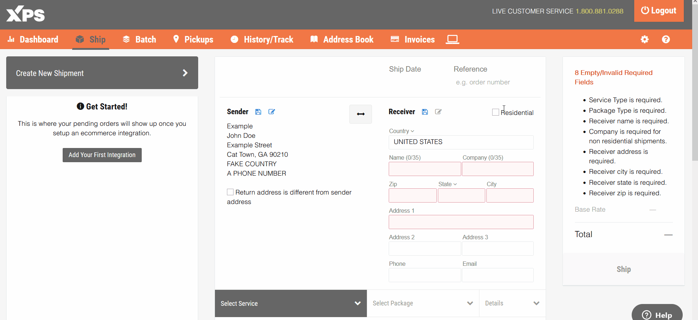

<h1 align="center">XPS Upcharge</h1>

  

## 👠 Features

- Uses GM/TM database
- Calculates upcharge with accurate and performant monitoring

## 🔧 Usage

Step 1 (skip if you already have the extension):

- Install [Tampermonkey ](https://www.tampermonkey.net/)
- or [Greasemonkey ](https://www.greasespot.net/)

Step 2:

- Install the script by clicking the link below
  <https://github.com/blackboardd/xps-upcharge/raw/main/xpsupcharge.user.js>

## 🧑‍🤝‍🧑 Contributing

Read the [contributing guide](/docs/CONTRIBUTING.md) to learn about our development process, and how to craft proposals.

## ⚖️ License

This project is licensed under the terms of the [MIT license](/docs/LICENSE).
